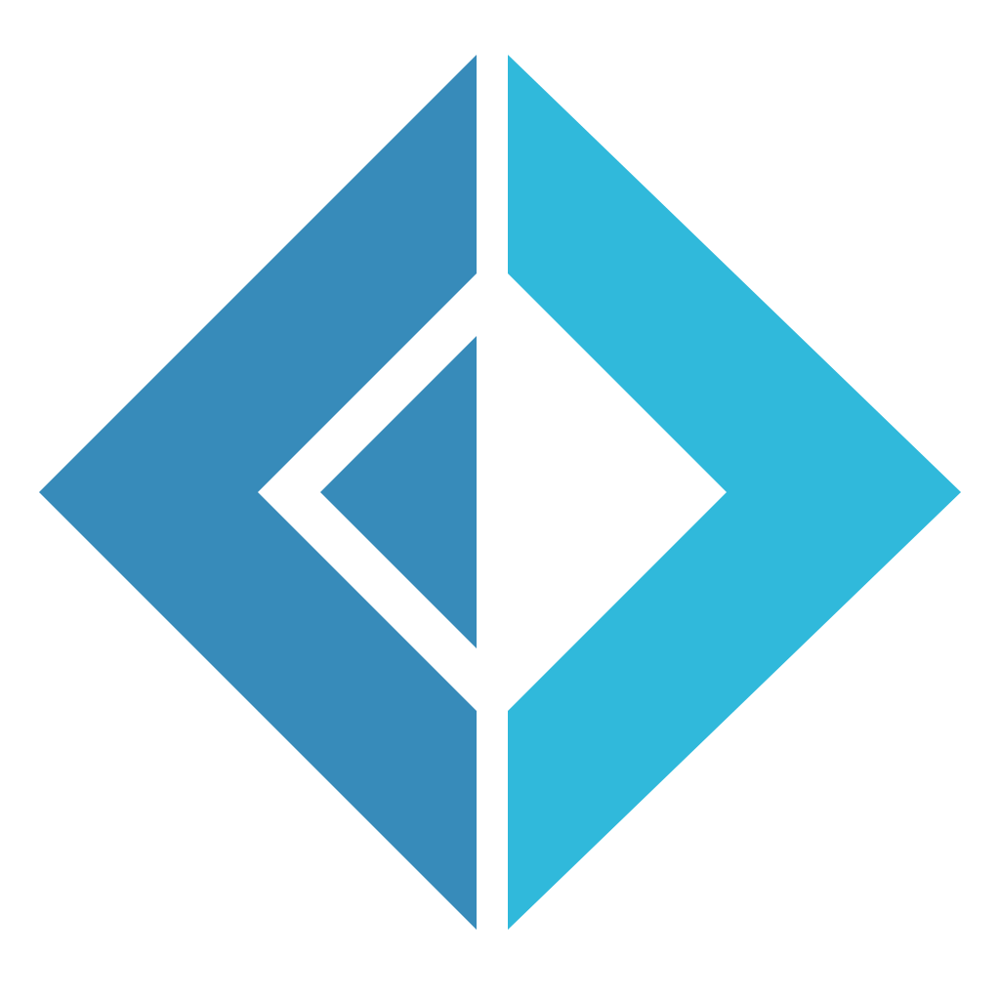

Welcome fellow traveller on your programming journey!

This site is dedicated to the simple proliferation of information related to educational efforts of Pete the Programmer.
The topics that are commonly discussed include:

- 
Test driven development.  What it means, getting started in your own team, and how it fits within the design and reliability aspects of software large and small.

- 
F#.  The functional language from Microsoft, and sister language to C#.  Why you should use it, how it fits within the .Net ecosystem, and how your team can reap the benefits of functional programming.

## More depth?

You are welcome to peruse the site at your leisure.

If you would like to go into more depth on these topics, [contact __Pete__](contact.md) to arrange an in-person discussion.
Anything from an [AMA](https://www.urbandictionary.com/define.php?term=AMA) over a lunch break to a multi-day course on any of the topics listed above.  Initial conversations are complimentary. Normal training rates apply.

